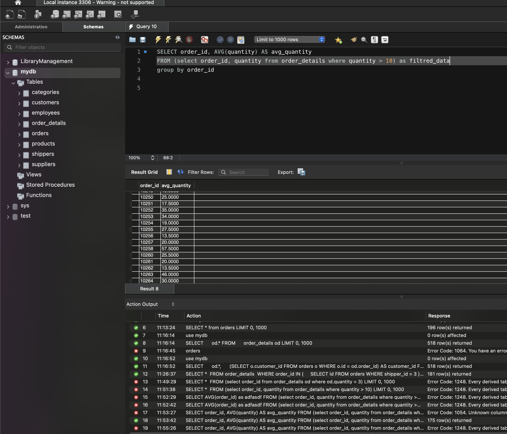

# Завдання 3: Обчислення середньої кількості товарів у замовленнях

## Опис
Напишіть SQL-запит, вкладений в операторі `FROM`, який спочатку вибирає всі рядки з `order_details`,  
де `quantity > 10`, а потім для отриманих даних обчислює середнє значення `quantity`,  
групуючи результати за `order_id`.

## SQL-запит
```sql
SELECT order_id, AVG(quantity) AS avg_quantity
FROM (
    SELECT order_id, quantity
    FROM order_details
    WHERE quantity > 10
) AS filtered_order_details
GROUP BY order_id;
```
