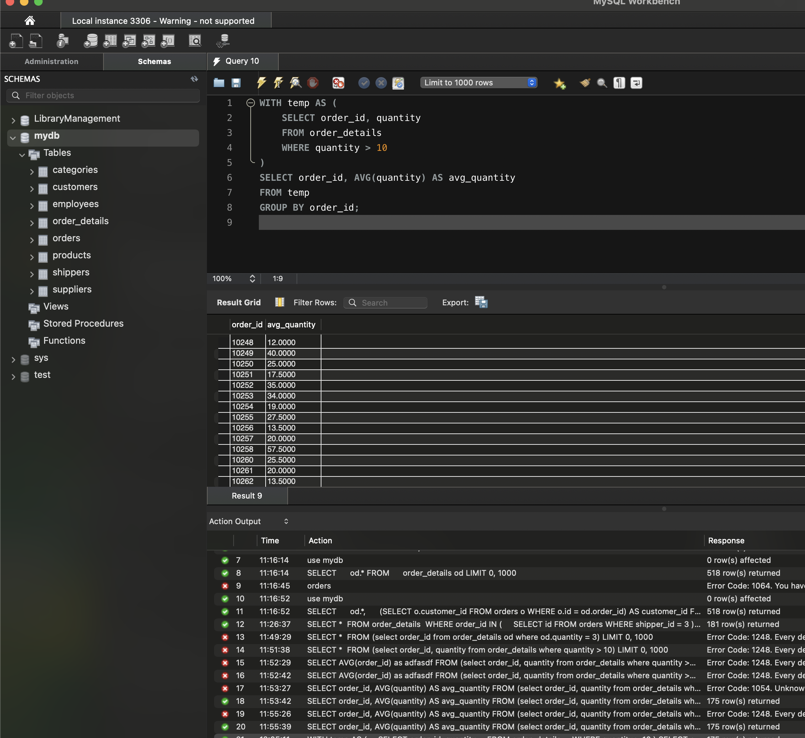

# Завдання 4: Обчислення середньої кількості товарів у замовленнях за допомогою WITH

## Опис
Напишіть SQL-запит, який використовує `WITH` для створення тимчасової таблиці `temp`,  
що містить усі записи з `order_details`, де `quantity > 10`.  
Потім обчисліть середнє значення `quantity`, групуючи результати за `order_id`.


## SQL-запит
```sql
WITH temp AS (
    SELECT order_id, quantity
    FROM order_details
    WHERE quantity > 10
)
SELECT order_id, AVG(quantity) AS avg_quantity
FROM temp
GROUP BY order_id;
```
