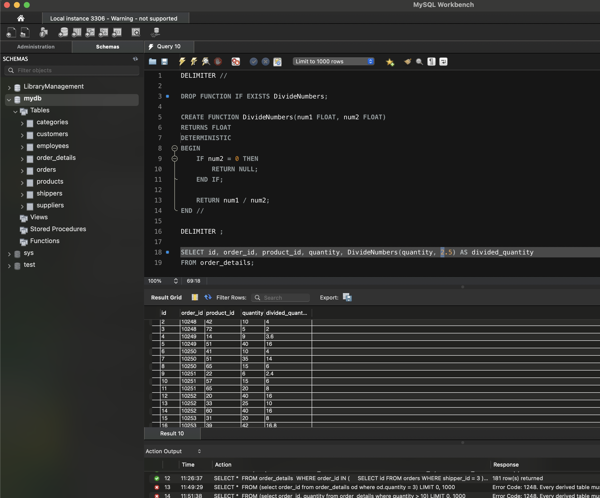

# Завдання 5: Функція ділення двох чисел та її застосування до order_details

## Опис
Створіть функцію `DivideNumbers`, яка приймає два параметри (`FLOAT`)  
та повертає результат ділення першого параметра на другий.  
Функція повинна перевіряти ділення на нуль та повертати `NULL`, якщо `num2 = 0`.  
Застосуйте функцію до атрибута `quantity` у таблиці `order_details`, поділивши його на `2.5`.


## SQL-запит
```sql
DELIMITER //

DROP FUNCTION IF EXISTS DivideNumbers;

CREATE FUNCTION DivideNumbers(num1 FLOAT, num2 FLOAT)
RETURNS FLOAT
DETERMINISTIC
BEGIN
    IF num2 = 0 THEN
        RETURN NULL;
    END IF;
    RETURN num1 / num2;
END //

DELIMITER ;

SELECT id, order_id, product_id, quantity, DivideNumbers(quantity, 2.5) AS divided_quantity
FROM order_details;
```
